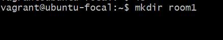
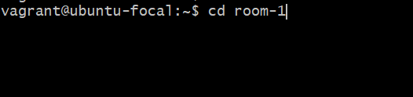
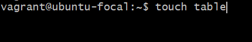
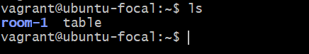
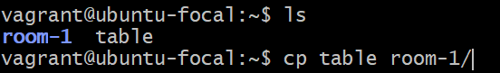
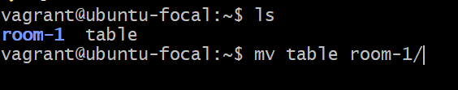
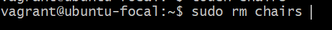
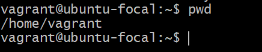
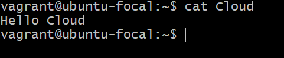

# List of linux commands

| Command | Usage | Image |
|---------|-------|-------|
| mkdir   | Used to create a directory |  |
| cd      | Change directory  |  |
| touch   | Create an empty file |  |
| ls      | list the content of a directory |  |
| cp      | Copy file                       |  |
| mv      | Move file                       |   |
| sudo    | Execute a command with root privilege |   |
| rm      | Remove a file                         |   |
| pwd     | Print current working directory       |  |
| cat     | Concatenates and displays the content of files |  |
