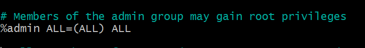
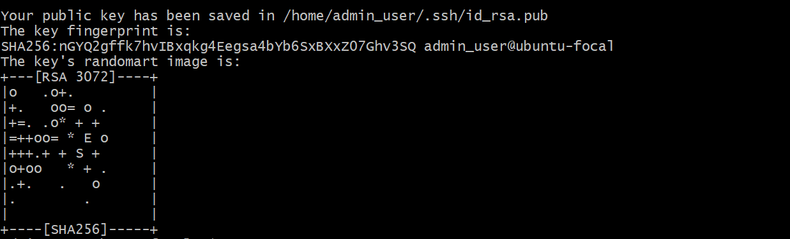

# Exercise:

Create 3 groups – admin, support & engineering and add the admin group to sudoers. 
Create a user in each of the groups. 
Generate SSH keys for the user in the admin group

## Solution

1
  >a. To create 3 groups\
    `sudo groupadd admin`\
    `sudo groupadd support`\
    `sudo groupadd engineering`

  >b.  To add the admin group to sudoers edit the sudoer file with ``sudo visudo``
    add this line to the file ``%admin ALL=(ALL) ALL`` 

2
  Create a user for each group\
  `sudo useradd -m admin_user -G admin`\
  `sudo useradd -m support_user -G support`\
  `sudo useradd -m engineering_user -G engineering`

3 to generate SSH key for the admin_user 
 `su - admin_user`
 `ssh-keygen`  